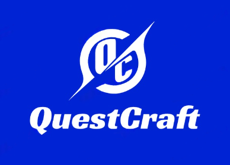

# QuestCraft
 
 

 
 
 

## 🌟 Project Overview

Hangman is a word guessing game developed in C++. The game challenges players to guess a secret word by entering one letter at a time. Players have a limited number of lives, and each incorrect guess reduces their remaining lives. The goal is to guess the entire word before running out of lives.

## 🛠️ Developers

PDKapralev24 - Frontend Developer
NKPeshev24 - Backend Developer

## 📱 Applications Used 

### Visual Studio - Used for creating the main program in C++.
### Teams - Used for communicating with team members during the project.
### GitHub - Used for pushing all the new updates to the program.
